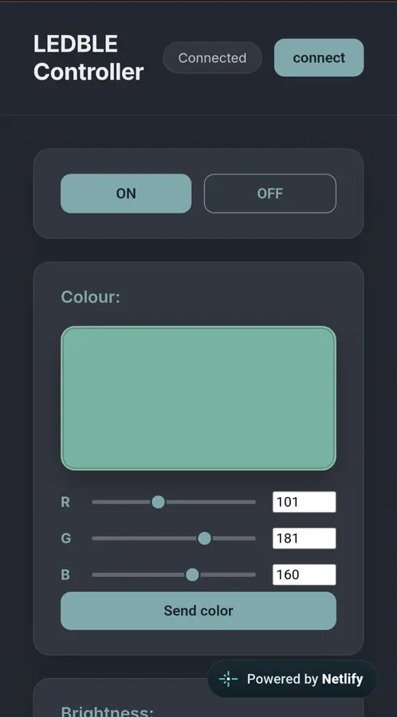
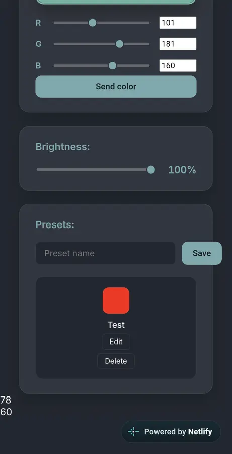

# LEDBLE Controller

A web app that connects to your Bluetooth LED strip and lets you set the exact RGB color that you want - no more guessing with sliders or color wheels and no more failing to connect. (This web app might not work for your specific device as the UID'S can varry)

**Got a LED BLE device? Try  the controller here → https://starlit-lolly-326867.netlify.app**

## Quick start

1. Open the link above on a Bluetooth-capable device using Chrome or Edge (Web Bluetooth isn't supported in Safari or Firefox).
2. Click **Connect** and select your LEDBLE strip from the pairing dialog.
3. Pick a color, hit send and watch your LEDs instantly change color.

## Running it locally
 
No build step or backend required — it's plain HTML/CSS/JavaScript.
 
- A modern browser with Web Bluetooth support (Chrome or Edge)
- A local static file server (needed because Web Bluetooth requires a secure context)
```bash
git clone https://https://github.com/Shu-rayh/Led-strip-controller.git
cd Led-strip-controller
python3 -m http.server 8000
```
 
Then open `http://localhost:8000` and connect to your strip.
## Some images




## Try it without a BLE device (Demo Mode)

You don't need an LED strip to test this app. Click **Try Demo** at the top of the page and the app connects to a built-in virtual LED strip instead of real Bluetooth hardware.

### What you'll see

- **A virtual LED strip** on screen that changes color, brightness, and on/off state, just like the real strip would.
- **The exact bytes the app would send.** Every time you press a button or move a slider, the raw command is printed underneath the strip in hex.

For example, sending a red color shows:

```
Sent: 7e ff 05 03 b1 00 00 ff ef
```

That's the same packet the app writes to a real strip:

| Bytes | Meaning |
|---|---|
| `7e ff` | Start of a command |
| `05 03` | Set color |
| `b1 00 00` | Red, Green, Blue values (here R = 177, G = 0, B = 0) |
| `ff ef` | End of the command |

### What works in Demo Mode

| Control | Command bytes |
|---|---|
| On / Off | `7e ff 04 01 ...` / `7e ff 04 00 ...` |
| Color sliders + Send Color | `7e ff 05 03 R G B ff ef` |
| Brightness slider | `7e ff 01 <percent> 00 ...` |
| Presets (save, edit, delete, apply) | Sends both a color and a brightness command |

### How it works

Demo Mode replaces the Bluetooth characteristic with a fake one (`emulator.js`). The rest of the app is unchanged. It builds the same byte packets and calls the same write function, so you're testing the real app code. The fake characteristic reads each packet and updates the virtual strip to match.

Because it doesn't use Web Bluetooth, Demo Mode also works in browsers that don't support it, such as Firefox and Safari.

### Using a real strip

Click **Connect** instead, in a Web Bluetooth browser like Chrome or Edge, and select your LED strip. This project was built and tested against an LEDBLE-00-3915 strip (service `ffe0`, characteristic `ffe1`).


## Demo
Watch the demo video on youtube → https://youtube.com/shorts/bWvfn4RX4Fs?si=fltGwEV1UII1_F8b
Unfortunately because not everyone will be able to use this project because I made it based on the BLE device that i have and others might be diffrent or they might not have a device at all, so to compensate I recorded a demo video of the web app working in action. 

## Features

- Precise RGB input (type exact 0–255 values instead of dragging imprecise sliders or using glitchy color wheels)
- Built-in brightness control
- Save, edit and delete color presets
- Live on-screen color preview that matches what the strip actually shows


## How it works

Cheap LED strip apps (like the stock LED BLE app) only expose color sliders, with no way to type an exact value, or only allows you to select colors from a glitchy, unresponsive color wheel which is  a dealbreaker if you're trying to match a specific RGB color or set a specific mood. Aonther issue with the stock app was that sometimes it would connect to the LED Strip controller other times it would'nt get picked up at all, it also requires you to turn on yoyur location which is weird why would an app for LED lights need to be able to use your location? My web app talks directly to the strip over the Web Bluetooth API instead, sending raw byte commands to the `0000ffe1` write characteristic under the `0000ffe0` service.

The strip uses a common "LED Lamp" protocol family shared by a lot of cheap BLE strips, light bulbs and other BLE LED devices, built around `7e`/`ff`-framed byte commands. A few candidate command sets for this family were tried against the strip directly until one worked. Each command follows a fixed frame: color changes are sent as `7e ff 05 03 [r] [g] [b] ff ef`, brightness as `7e ff 01 [0–100] 00 ff ff ff ef`, and power as `7e ff 04 [00|01] ff ff ff ff ef`.

## Credits

The stock LED BLE app (Titled "LED BLE" on the google play store) was used as a reference point.
Used Claudes assistance for the following:
- Setting up the bluetooth API
- Uuid codes for the controller: Claude gave all the common codes it could find, which I tested against my strip controller until I found the working one.
- Help with the css: I wrapped my html in appropriate id's, and gave that code as well as my ui sketch and it gave me the basic css which I used as a guideline while coding the css. 


